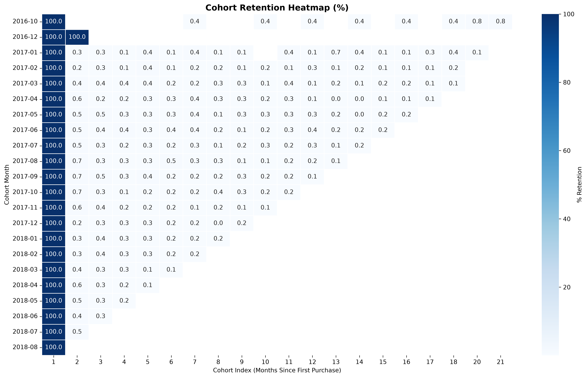
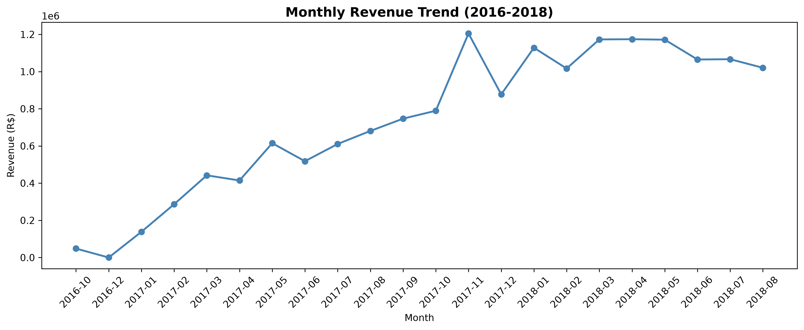
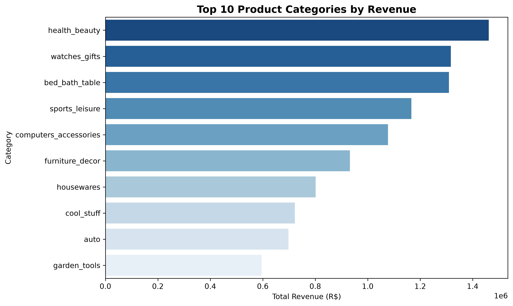
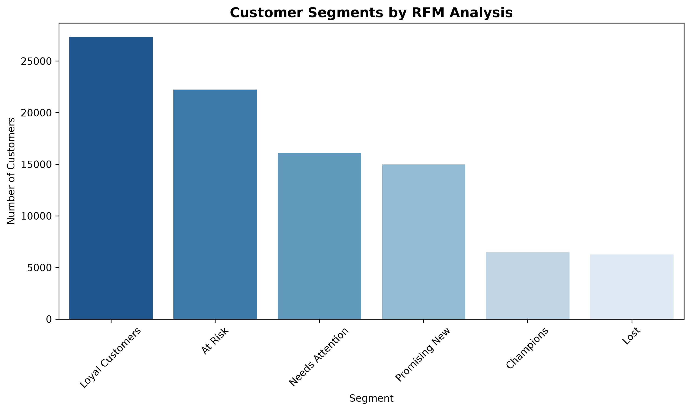

# E-Commerce Advanced Analytics
### Python | Pandas | Seaborn | Matplotlib | RFM | Cohort Analysis | CLV

## Project Overview
End-to-end advanced analytics on 100,000+ orders from Olist Brazilian 
E-Commerce platform. Built a complete analytics pipeline covering data 
cleaning, EDA, RFM customer segmentation, cohort retention analysis, 
and Customer Lifetime Value calculation.

## Business Problem
How do we identify which customers are most valuable, which are at risk 
of leaving, and how much revenue can we expect from existing customers 
over the next 12 months?

## Dataset
Olist Brazilian E-Commerce — [Kaggle](https://www.kaggle.com/datasets/olistbr/brazilian-ecommerce)
- 9 relational tables merged into one master DataFrame
- 115,720 delivered orders after cleaning
- 93,357 unique customers

## Tools Used
- Python — Pandas, NumPy, Matplotlib, Seaborn
- Jupyter Notebook
- GitHub

## Analysis Modules

### 1. Data Loading + Cleaning
- Merged 9 CSV files into one master DataFrame
- Filtered delivered orders only
- Fixed nulls, converted date columns
- Created total_revenue column

### 2. Exploratory Data Analysis
- Monthly revenue trend (2016–2018)
- Top 10 product categories by revenue
- Revenue by state
- Payment method breakdown
- Review score distribution

### 3. RFM Customer Segmentation
- Calculated Recency, Frequency, Monetary per customer
- Scored each metric 1–5 using NTILE
- Assigned 6 business segments:
  - Champions, Loyal Customers, Promising New
  - At Risk, Needs Attention, Lost

### 4. Cohort Retention Analysis
- Grouped customers by first purchase month
- Tracked repeat purchase rate month over month
- Built full cohort retention matrix
- Visualized as heatmap

### 5. Customer Lifetime Value (CLV)
- Calculated AOV, purchase frequency, lifespan per customer
- CLV by RFM segment
- Top 100 highest CLV customers identified

## Key Business Insights

**1. 25x Revenue Growth in 13 Months**
Revenue grew from R$48K in Oct 2016 to R$1.2M by Nov 2017.
November 2017 Black Friday spike confirms strong seasonal demand.
→ Build pre-Black Friday campaigns 60 days in advance.

**2. Health & Beauty Leads Revenue**
Top 3 categories (Health & Beauty, Watches & Gifts, Bed/Bath/Table)
account for 22% of total revenue.
→ Prioritize seller acquisition in these categories.

**3. Geographic Concentration Risk**
São Paulo alone generates 35% of total revenue. Top 3 states 
account for 58% of all revenue.
→ Expand seller network in underserved states.

**4. At Risk Segment = Biggest Revenue Threat**
22,229 At Risk customers generate R$3.96M — highest of any segment.
Champions (6,463 customers) have the highest average CLV.
→ Launch re-engagement for At Risk. Protect Champions with VIP program.

**5. Retention Drops Sharply After Month 1**
Most customers never make a second purchase. Late 2017 cohorts 
show better retention than 2016 cohorts.
→ Implement post-purchase email sequence within 7 days of delivery.

**6. Credit Card Dominates at 75%**
Boleto accounts for 19% — significant for Brazilian market.
→ Offer installment incentives to increase average order value.

## Charts

### Monthly Revenue Trend

### Top 10 Categories by Revenue

### RFM Customer Segments

### Cohort Retention Heatmap

## Project Structure

## Author
**Muhammad Aqib Khan**
Statistical Officer | Data Analyst
[LinkedIn](https://www.linkedin.com/in/your-profile) | 
[GitHub](https://github.com/Aqibkhan001)
